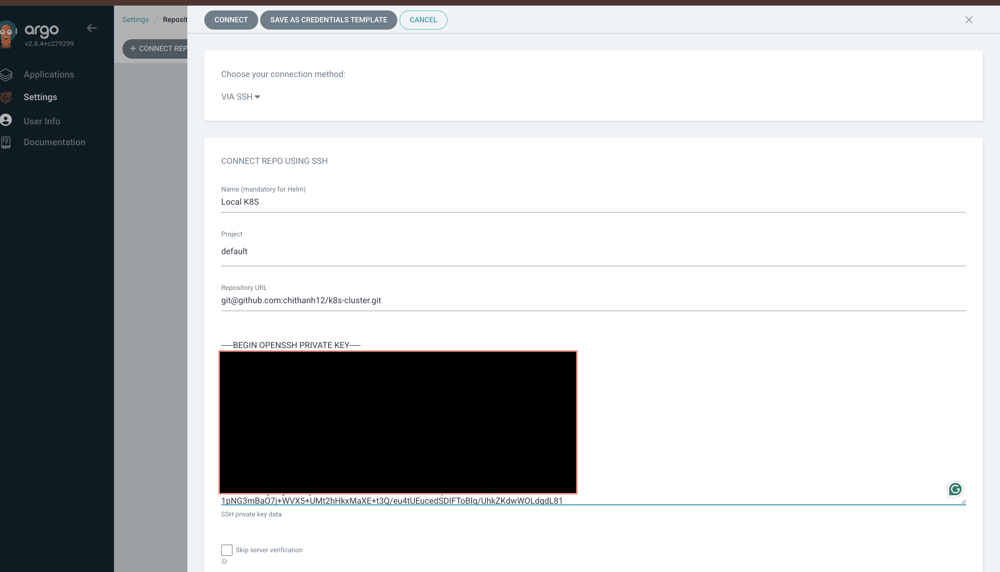
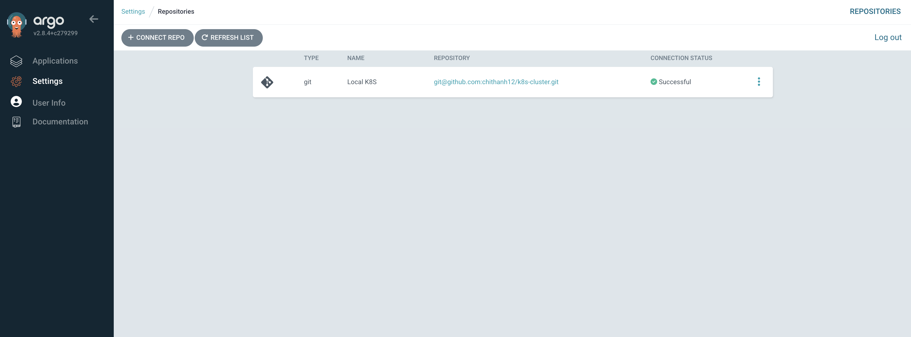
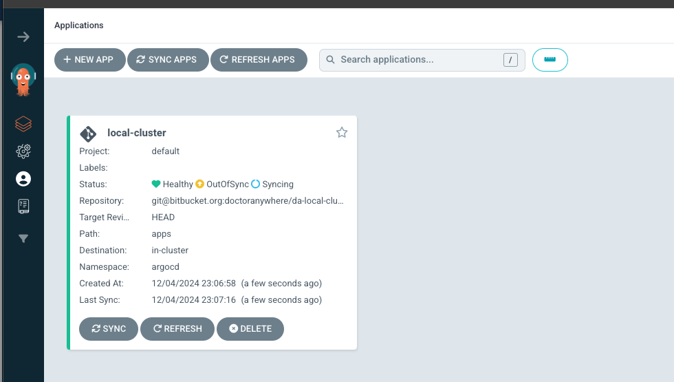
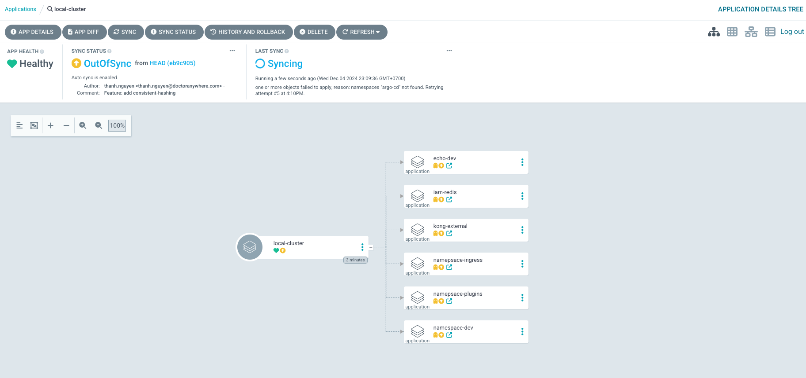
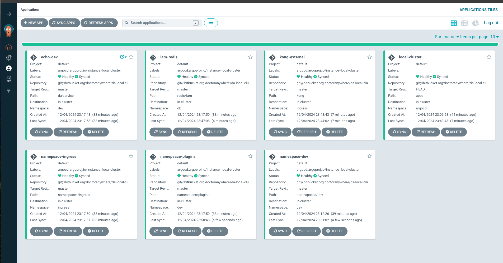
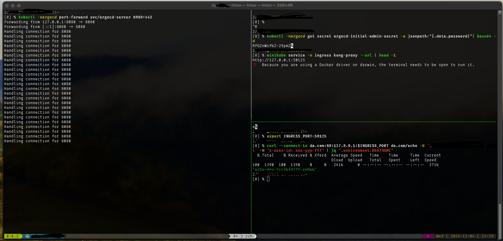

# Prerequiste
Before we start to playaround with it, you have to install the following apps on your pc
- Minikube
- helm 
- kubectl 
- docker (colima or rancher desktop)
# Start minukube 
- Start minikube `minikube start` 
- Verify minikube start correctly `minikube status`
# Install argocd
Run the following commands to install argocd:
```
## Create a new namespace for argocd
$ kubectl create ns argocd

## Add argocd-helm to helm repo & update repository
$ helm repo add argo-cd https://argoproj.github.io/argo-helm
$ helm dep update argocd/

## Install to k8s
$ helm install argocd argocd/ -f argocd/values.yaml -n argocd

## Get admin password
$ kubectl -nargocd get secret argocd-initial-admin-secret -o jsonpath="{.data.password}"| base64 -d

## Forward port of argocd server to host and access web UI
$ kubectl -nargocd port-forward svc/argocd-server 8080:443 
```
Then connect to the argocd by visit the website at: `localhost:8080` with account `admin/{previous_password_step}`

Next, open Repository setting and add a new repo for project as screenshot 




# Create a first application 
- Create a new Application for `k8s-cluster` --> This will manage all the other applications in argocd by running command 
```
kubectl -nargocd apply -f init-apps.yaml
```
After previous step you can see a new application name `k8s-cluster` as following image.


Click on the k8s-cluster application then you will see there're several children applications as screenshot.



After a while, you will see all the chidren applications are synced as screenshot below


> [!NOTE]  
> If the kong-external application got issue with ssl (github.com), you can temporary disable netskope, stop minikube, stop colima and start them again. If it still not working, restart your laptop and start colima, minikube again.


- Expose kong proxy to host port
Then you can export Kong proxy to your host to test your service by using the following command:
```
$ minikube service -n ingress kong-proxy --url | head -1
```

The output is similar this:
```
[0] % minikube service -n ingress kong-proxy --url | head -1
http://127.0.0.1:64191
❗  Because you are using a Docker driver on darwin, the terminal needs to be open to run it.
```

| Note: Remember the ouput port, then we will use it later.

Do testing some api endpoint as bellow:

```
export INGRESS_PORT=64191
curl --connect-to da.com:80:127.0.0.1:$INGRESS_PORT da.com/echo -H "X-Client-ID: b2b.admin.portal" -H "x-user-id: xxx-yyy-fff" | jq ".environment.HOSTNAME"
```
